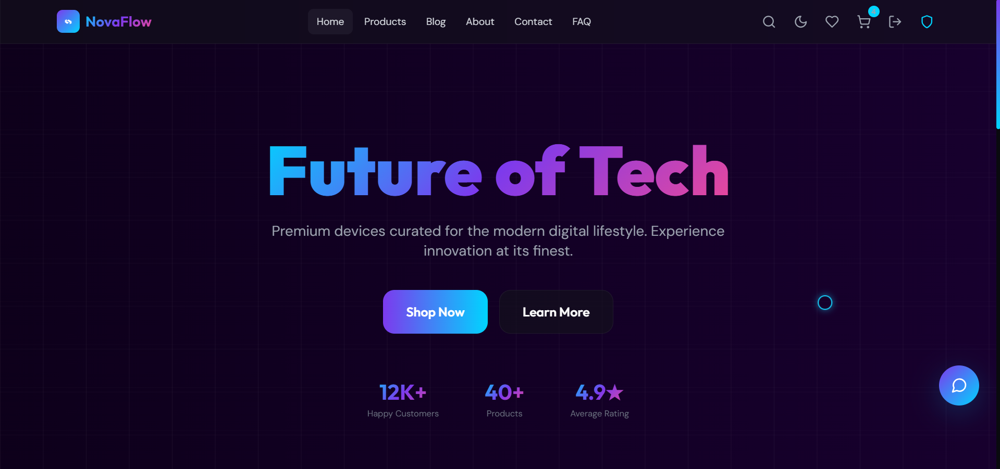

# 🚀 NovaFlow Store v5.0.0

*A full‑stack e‑commerce website built as a final project for an advanced web development course –  
dark neon aesthetic, powerful admin panel, and hidden Easter eggs.*

## 📖 Overview

NovaFlow Store is a **complete, database‑driven online shop** built with a custom JavaScript SPA frontend and a PHP/MySQL backend.  
It features **42 uniquely branded tech products** (each with AI‑generated images), a seamless shopping experience from browsing to checkout, and **three hidden Easter eggs** that reward curious visitors.

Every detail – from the animated glass‑morphism cards to the SHA‑256 password hashing – was hand‑crafted by a solo developer.

## ✨ Features

### 🔐 Authentication & Security
- **Modal login/register** (AJAX + JSON) – no page reload
- **Password hashing** with SHA‑256
- **Role‑based access** (admin / user)
- **Session protection** for admin pages

### 🛍️ Product Catalog & SPA
- **42 hand‑curated tech products** across 4 categories
- **AI‑generated product images** branded with the NovaFlow logo
- **JavaScript SPA router** with client‑side history (`hash`‑based)
- **Real‑time filtering & sorting** by category, price, rating, and search
- **Product detail page** with image lightbox, full specs table, and review section

### ❤️ Wishlist & Compare
- **Heart button** toggles wishlist (stored in `localStorage`)
- **Compare up to 3 products** side‑by‑side in a modal with spec comparison

### 🛒 Cart & Checkout
- **Add to cart** from anywhere – cards, detail page
- **Cart management** (quantity controls, remove, dynamic totals)
- **Checkout form** with full validation
- **Order processing** → stock reduction → order success page with summary

### 📦 Admin Panel
- **Full CRUD** for products (name, price, stock, emoji, specs, images)
- **Image upload validation** (real image check, size limit, duplicate names)
- **“Featured” checkbox** to highlight products on the homepage
- **Order management** (pending → shipped → delivered)

### 📞 Contact & Feedback
- Contact form saves messages to the database
- Beautiful success feedback with **3‑2‑1 countdown redirect**

### 🎨 Visual Design
- **Animated dark background** with floating orbs, grid overlay, and particle canvas
- **Glass‑morphism cards**, neon gradients (`#7c3aed`, `#00d4ff`, `#ec4899`)
- **Custom glowing cursor** that enlarges on interactive elements
- **Fully responsive** – looks great on any screen

### 🥚 Hidden Easter Eggs
Three secret surprises that open in new tabs with the NovaFlow favicon:

| Easter Egg | Trigger |
|------------|---------|
| **3D Room** (pure CSS) | Click the word *“lifestyle”* in the hero subtitle |
| **Bongo Cat** (SVG animation) | Click the word *“love”* on the Contact section |
| **Neon Spider** (canvas) | Triple‑click the NovaFlow logo in the header |

### 📄 Additional Pages (SPA)
- **About** – personalized founder story, quote, and portfolio link
- **Blog** – 4 tech articles with links to real sources
- **FAQ** – collapsible accordion

## 🛠️ Tech Stack

| Layer       | Technology |
|-------------|------------|
| Frontend    | HTML5, CSS3, Tailwind CSS (runtime), Lucide Icons, JavaScript (ES6) |
| Backend     | PHP (MySQLi) |
| Database    | MySQL (phpMyAdmin) |
| Server      | Apache (WAMP) |
| Image Gen   | Google Gemini (AI product images) |

## 🚀 Installation & Setup

1. **Clone or download** this repository into your WAMP `www` folder.
2. **Import the database**:
   - Open phpMyAdmin.
   - Create a new database called `novaflow_db1`.
   - Import the provided `novaflow_db_backup.sql`.
3. **Configure the database connection**:
   - Open `config/database.php` and adjust credentials if necessary (default: `root` / empty password).
4. **Access the site**:
   - Launch WAMP and open `http://localhost/NovaFlow-Store-v5.0.0/public/` in your browser.

## 🔑 Demo Accounts

| Role            | Email                        | Password   |
|-----------------|------------------------------|------------|
| Admin           | admin@novaflow.com           | admin123   |
| User            | user@novaflow.com            | user1234   |
| Nazanin CIP     | nazanincip@novaflow.com      | 2009       |
| Jake Williams   | jake.williams@novaflow.com   | user1234   |
| Emily Johnson   | emily.johnson@novaflow.com   | user1234   |
| Mike Chen       | mike.chen@novaflow.com       | user1234   |
| Sophia Martinez | sophia.martinez@novaflow.com | user1234   |
| Ryan Thompson   | ryan.thompson@novaflow.com   | user1234   |

## 📁 Project Structure

NovaFlow-Store-v5.0.0/
├── assets/
│   ├── css/
│   ├── js/
│   └── images/
├── config/
│   └── database.php
├── includes/
│   ├── header.php
│   ├── footer.php
│   └── auth.php
├── admin/
│   ├── products.php
│   ├── orders.php
│   └── action/
│       ├── product_action.php
│       └── order_action.php
├── user/
│   ├── orders.php
│   └── action/
│       └── order_action.php
├── public/
│   ├── index.php
│   ├── product.php
│   ├── login.php
│   ├── register.php
│   ├── contact.php
│   ├── success.php
│   ├── order_success.php
│   ├── logout.php
│   ├── action_login.php
│   ├── action_register.php
│   ├── action_contact.php
│   ├── process_cart_checkout.php
│   └── easter-egg/
│       ├── 3Droom/
│       ├── bongo-cat/
│       └── neon-spider/
├── uploads/
│   └── products/
├── novaflow_db_backup.sql
└── README.md

## 🐞 Known Issues & Notes
- The Easter eggs are **intentionally hidden** – there are no visible links or hints.
- The **Tailwind CSS runtime** is used for on‑demand styling; this triggers a console warning about production use (harmless).
- The original `_sdk` scripts from the template have been removed to prevent 404 errors.
- The CSP (Content Security Policy) warning about `eval()` is caused by a single inline PHP script and does **not** affect functionality.

## 📈 Future Roadmap
- [ ] Real **reviews & ratings** system (database table already exists)
- [ ] **Order history** for logged‑in users
- [ ] Extract JavaScript to external files
- [ ] Add **forgot password** demo
- [ ] Advanced search with server‑side filtering

## 👩‍💻 About the Developer

**Nazanin** – *Founder, Designer & Developer*

> “I build things that make people feel something – and a great store should feel like home.”

This project was built solo, from scratch, over many late nights and countless cups of coffee.  
Every pixel, every line of code, and every Easter egg was created with passion.

[🌐 Visit My Portfolio](#) *(coming soon)*

**© 2026 NovaFlow Store – Made with passion, coffee, and neon dreams.**
